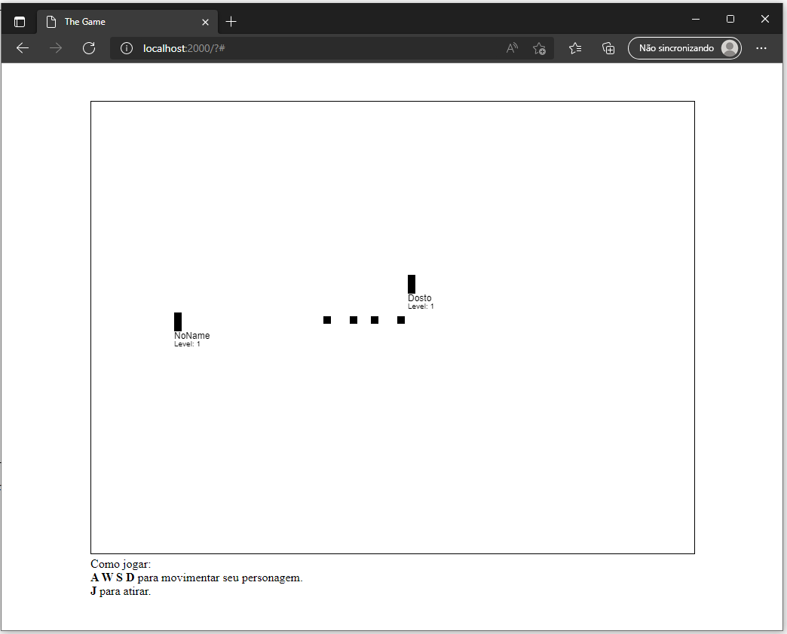

# ⚔ Multiplayer RPG
## Introduction
Simple Multiplayer RPG game build with Socket.IO where you able to explore some fields and fight some monster with your friends!

## Features
### Implemented
- Player movement
- Long-range attack

### To-be implemented
- Enemy logic
- Terrain collission
- Multiple maps
- Better graphics

## How to run
- Clone the code with `git clone`
- Install [NodeJS](https://nodejs.org)
- Run `npm install` to install dependencies
- Start game with `npm run start`
- Type `http://localhost:2000` in your browser